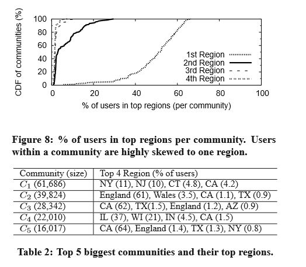
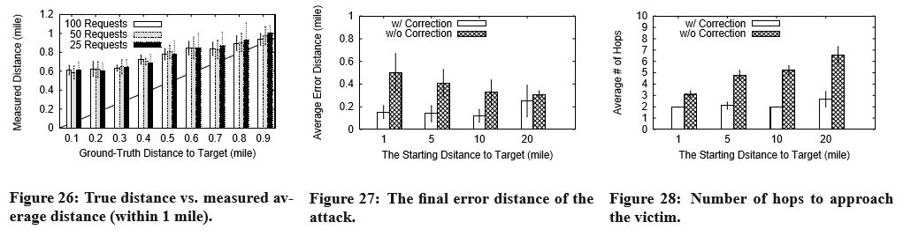

## 在暗处低语：匿名社交网络的分析
Gang Wang,Bolun Wang,Tianyi Wang,Ana Nika,Haitao Zheng,Ben Y.Zhao

加州大学圣巴巴拉分校计算机科学系

{gangw,bolunwang,tianyi,anika,htzheng,ravenben}@cs.ucsb.edu

### 摘要
近年来，社交互动和人际交往已经发生巨大改变。隐私意识的提高以及诸如斯诺登披露事件的发生，加剧了新一代匿名社交网络和消息应用程序的发展。通过移除身份和社会联系这些传统概念，这些服务鼓励陌生人之间的交流，并允许用户表达自己而不用担心欺凌或报复。

尽管有数百万的用户和数十亿的页面月浏览量，而对像Whisper这样的服务如何改变社会互动形式和内容的实证分析却几乎没有。在Whisper网络覆盖范围内，通过对超过100万名的独立用户所写下的2400万条发言进行长达完整3个月的跟踪，我们在这篇文章中提出了对一个匿名社交网络进行的第一次大规模实证研究的成果。我们试图了解匿名性和社会联系的缺失是如何影响着用户行为的。我们从多个角度分析Whisper，包括：在缺少持续性社交的情况下的用户交流结构，随着时间推移的用户参与度和网络粘性，以及在一个用户责任最小化的网络中的内容审核。最后，我们敲定并进行了攻击测试，对Whisper用户进行了详细位置跟踪。我们已通知了Whisper，他们已经采取措施处理这个问题。

### 类别和学科描述
J.4 [计算机应用]：社会和行为科学；

K.6 [计算机和信息系统管理]：安全和保护

### 常用术语
测量；设计；安全

### 关键词
匿名社交网络；图表；用户参与度；隐私

### 1. 引言
在过去十年中，在线社交网络（OSNs）例如Facebook，LinkedIn和Twitter，彻底改变了我们的交流方式。通过将我们的离线社交关系正式化为数字形式，这些网络极大地扩展了我们的社交量，无论是数量还是频率。

然而，行业格局正在发生变化。发布在Facebook上的内容现在常用于审核求职者，支持离婚诉讼，以及终止雇佣。另外，研究表明，尽管社交网络发生变化以鼓励更广泛的信息分享[34]，用户寻求隐私的行为却显著增长。最后，这些趋势只是加速了在斯诺登披露之后的新泄露，通过这些头条新闻来提醒互联网用户，他们的网上行为已经在国家安全局和其他组织的持续审查下。

所有的这些促成了保护隐私的通信和社交网络工具急剧发展的新浪潮。这些快速增长的服务是伪匿名消息移动应用程序：SnapChat通过确保照片在几秒钟之内自我销毁的技术登上头条新闻；Whisper允许用户匿名发布自己的想法给公众；以及Secret允许用户和朋友们分享内容而不透露他们自己的身份。这只是冰山一角，许多类似的服务正以增长的频率出现，如，Tinder，Yik-yak，和Wickr。

这些通信工具的匿名性同时吸引了坚定的支持者和批判者。支持者认为，他们为举报人提供了避免起诉的宝贵渠道，并且允许用户表达自己的想法而不用担心欺凌或虐待[40,41]。批判者认为，这些网络中缺少问责制度，从而鼓励了消极言论的产生，包括人身攻击，威胁和谣言传播[2,4]。然而双方都认为这些工具已经对用户互动和交流产生了巨大的影响。

我们通过对Whisper进行详细测试和分析，将在本文中描述我们的经验和对伪匿名社交网络的发现。Whisper是一个移动应用程序，允许用户在上面发布和回复公共消息（如，网络模因），并都使用匿名用户标识图像。Whisper不会将任何私人身份信息和用户ID联系起来，不会归档任何用户历史记录，不会支持用户间持续的社交联系。这些设计选择与Facebook等网络中的那些截然相反。然而，它们却使Whisper成为了最受欢迎的新型社交网络之一，每月页面浏览量超过30亿。在我们的工作数据集中，我们在2014年2月开始的3个月期间，捕获了Whisper100%的数据流，包括超过100万名的独立用户所写下的2400万条发言和回复。

我们将研究集中在Whisper匿名的净影响上，通过对比传统的需要身份认证和社会联系的网络媒体。鉴于Whisper和诸如Facebook及LinkedIn这样的领军者之间存在巨大的差异，我们的分析会包含未来基础设施对社交网络的巨大影响，消息网络中的用户隐私问题，以及我们对社会行为的理解。更具体地说，我们的研究也揭示了匿名社交网络的长期可持续性，鉴于持续性社会联系的变更，通常会考虑当代网络的“粘性”的关键作用。

我们的分析提供了几个重要发现。
- 首先，我们试图了解在缺少社会联系时的用户交互行为。我们建立了交互图表并将它们和Twitter和Facebook那样的传统社交网络进行对比。毫不意外地，我们发现用户交流模式显示出高度分散，低度聚集，与之前的系统有很大的不同。我们观察到每个用户的“朋友”都是非常短暂的，并且强烈的，长期的友谊十分罕见。
- 第二，我们对用户活动的研究表明，新用户的不断涌现对内容生成具有重大意义，且用户明显分成短期（1-2天）和长期用户。我们论证了可以通过应用ML技术分析用户的一周活动历史，准确地将用户划分为两组之一。
- 第三，我们通过分析“被删除的悄悄话”来研究关于辱骂性内容的问题。我们发现大多数被删除的悄悄话都集中于成人内容，且Whisper的审核小组会在攻击性的悄悄话初始发布之后的短时间内将其删除。
- 最后，我们确定了一个重大的攻击，可以将现在的Whisper用户的详细地理位置暴露出来并进行位置跟踪。我们将会详细描述这个攻击以及我们进行的实验。需要注意的是，我们已经将这个漏洞告知了Whisper，并且他们已经采取了积极措施来缓解这个问题。

据我们所知，我们是第一个将Whisper和伪匿名消息系统分为一组进行详细研究的。他们在移动平台快速增长的用户数量表名他们可能对今天已建立的OSN提出了一个真正的挑战。我们相信，我们最初的工作揭示了这些系统作为新平台的人际交流，并提供了对网络基础设施设计的深入理解 ，以支持Whisper和类似的服务。

### 2. 背景和目标
在本节中，我们会简要介绍Whisper网络的背景信息，随后会对我们的研究目标进行一个高层次的总结。

#### 2.1 背景：Whisper网络
Whisper.sh是一款已有两年历史的智能手机应用程序，已经在伪匿名消息和社交服务新浪潮中成为了一个领导者，包括Snapchat，Secret，Tinder，Yikyak，Ether和Wickr。尽管详细功能可能会有所不同，这些服务通常使用户能够发表声明，分享秘密或八卦，同时还能保持匿名性和不可追踪性。

作为一个仅限移动设备的服务，Whisper允许用户使用匿名昵称发送消息，接收回复。自2012年推出以来，它受欢迎程度非常高，截止2014年初，平均每月页面浏览量超过30亿。功能非常简单：这款应用基于消息的关键字覆盖了每个用户在背景图片上的短文本消息。由此产生的私语被发布给公众，并使用用户的随机或自选昵称。其他人可以匿名喜爱（Whisper的“喜欢”版本）一个消息，或者公开跟进回复他们自己的私语。另外，用户们可以给一个私语的作者发送私信聊天，并且私人消息只对参与者可见。

**用户匿名**  Whisper对匿名的关注打破了一些传统社交网络的核心设想，如Facebook或Google+。首先，Whisper用户只能通过随机分配（或用户自选）的昵称认证身份，不会和任何私人信息联系起来，如电话号码或电子邮件地址。第二，Whisper服务器只存储公共的私语，用户的私人消息只存储在他们的终端用户设备。没有任何能够搜索或浏览一个特定用户的历史消息或回复的功能。第三，用户之间没有长久的社会联系的概念。（如，Facebook的朋友，Twitter的粉丝）因此，鼓励用户和更大范围的陌生人交流，而不是一群已知的“朋友”。

**公共消息供应**  没有社交链接，用户可以在几个公共列表浏览内容，而不是他们朋友的消息供应（或追随者）。这些列表包括一个最新列表，包含了最新的私语（系统方面）；一个附近列表，展示了在附近区域发表的私语（半径范围约40英里）；一个流行列表，只显示收到最多喜欢和回复的前几个私语；以及一个精选列表，显示了一部分受欢迎列表中的消息，这些消息是由Whisper内容管理员亲手挑选的。所有这些列表都是根据最新来分类内容。

#### 2.2 目标
在目前的形式下，对于伪匿名对社交网络影响的研究，Whisper代表了一种理想的可能性。三个关键属性使其成为研究和分析的理想选择。首先，Whisper是集中的，即有一个单一的数据流是所有用户都可以访问的。第二，Whisper可以定期收集数据，即内容是未加密的且过程在一个适量的时间段内持续。第三，我们能够见到Whisper的管理团队，并获得收集和分析Whisper公众数据流的许可。

在较高的层面上，我们的首要目标是了解用户在伪匿名社交网络上的交流方式，匿名对用户行为的影响及其对用户交互、长期用户参与度和网络稳定性的影响。通过对Whisper的网络结构进行基本分析，我们可以把我们的目标分成几个具体的问题。首先，用户是如何在匿名环境下交互的，他们是否形成了类似于在传统网络中的社区？第二，Whisper对于身份认证的缺失是否会消除用户之间的紧密联系，并且它是否消除了传统社交网络中对用户长期参与至关重要的粘性？并且由于缺乏用户特定的网络效应，是否有可能使用短期历史线索对用户参与进行建模和预测？最后，伪匿名对用户内容和用户隐私的影响是什么？

### 3. 数据和初步分析
在深入分析Whisper之前，我们首先描述我们的数据收集方法和收集的数据集。然后，我们描述了对数据集的一些高级分析。

#### 3.1 数据收集
我们的目标是收集whisper用户和他们发布在整个网络上的回复。鉴于Whisper不存档历史数据，我们的方法是在很长一段时间内（从2014年2月到5月）不断抓取新发布的私语。我们专注于“最新”列表，这是来自所有whisper用户的最新私语的公共流。与“附近”和“流行”等其他公共列表不同，“最新”列表提供了对网络中所有私语的访问。因为Whisper不提供第三方API，所以我们删除了Whisper网站上的“最新”列表。

每个下载的私语包括一个用户ID，时间戳，纯文本的私语，作者的GUID，作者的昵称，位置标签，收到的喜欢和答复的数量。作者的GUID并不用来充当每个用户的持久ID，而是通过这种方式实现的，因为Whisper对私有消息依赖与第三方服务。作者的GUID使跟踪用户的文章成为可能。在我们将这个问题报告给Whisper的管理团队后，他们在2014年6月删除了GUID字段。位置标记显示城市和州级别的用户位置（例如，洛杉矶、加利福尼亚州），并且只有在私语作者启用了位置共享权限时才可用。对私语的回复是相似的，唯一的区别是回复内容也用线程中之前私语的用户ID标记。

**爬取**  我们实现了一个具有两个组件的分布式web爬虫程序，一个主要的爬虫程序提取最新的私语列表，一个回复的爬虫程序检查之前的私语并收集与现有私语相关联的所有应答序列。我们观察到Whisper服务器保留了一个最新的10K私语队列。每30分钟运行一次主爬虫，确保我们捕捉到所有新的私语。相比之下，爬取回复内容的程序的计算量更大。我们每7天抓取一次回复内容，并检查上个月所有留言的新回复。在实践中，我们观察到私语通常在发布一周后没有收到后续回复。

我们从2014年2月6日到5月1日运行我们的爬虫。在这大约3个月的时间里，我们总共收集了9,343,590条小道消息，有15,268,964条回复和1,038,364条独特的GUID。由于服务器端队列，我们收集了连续的数据流，尽管更新爬虫代码时有少量中断。唯一需要注意的是，应Whisper在4月20日的请求，我们使用一组新的API调用将爬虫程序转移到另一个Whisper服务器上。这一转变减轻了Whisper的负荷，但产生了没有位置标签的私语。由于这只影响了10天的数据，我们认为这对基于位置特性的分析影响不大。

**验证一致性**  我们通过一个小实验进一步验证了“最新”数据流的完整性。我们使用HTTP请求同时抓取西雅图、休斯顿、洛杉矶、纽约、旧金山和芝加哥附近6个地点的“附近”数据流。我们用了6个小时捕获这些数据流，并确认来自6个位置的2000+私语在同一时间内都出现在“最新”数据流中。

**局限性**  我们的测量无法捕捉两种类型的数据。首先，我们不捕捉那些只阅读或消费私语，却从不发布任何内容的用户。由于这些被动用户不会生成可见的用户交互，因此它们不太可能影响我们的大多数结论。其次，我们的数据仅限于可见的公共数据，我们无法访问用户之间的私有消息。因此，我们的结果代表了系统中用户交互的下限。正如我们稍后讨论的，我们认为公共交互和私有消息之间应该有很强的相关性。

#### 3.2 初步分析
接下来，我们将展示一些关于私语、回复和用户数据集的高级结果。在本节中，我们的结果设置了上下文，以便在后面的部分中对用户行为和匿名进行更详细的分析。

**随着时间推移的私语**  随着时间的推移，我们从浏览私语的帖子开始。图2显示了在我们的研究期间每天发布的新私语和回复的数量。如图所示，Whisper中的新内容相对稳定，平均每天有10万条新私语和20万条回复。一个有趣的发现是，在任何时间段里，回复的数量都比最初的私语要多得多。

在我们的数据收集过程中，我们发现大部分私语被作者或Whisper的版主删除。据我们所知，旧的私语不会“过期”，只会停留在Whisper服务器上，可以通过一系列的回复来引用。但是，对于删除的私语，当我们试图重新抓取它们的回复时，我们会收到一个“私语不存在”的错误。在每天发布的10万条新消息中，约有18%最终被删除。我们稍后在§6会详细分析被删除的私语。

**回复**  用户可以回复新的私语或其他回复。多个回复可以产生自己的回复，从而形成以原始私语为根的树形结构。图3和图4显示了每个私语的回复总量和每个私语的最长链长（最大树深）。不出所料，55%的私语没有得到回复。因为所有的私语都发布在相同的公开列表中，所以每个私语只有一个短时间窗口吸引用户的注意力。在有回复的私语中，大约25%的人至少有两个回复。这些基本上成为用户之间的对话线程。

图5给出了回复到达时间的分布，即每个回复与原私语之间的时间间隔。54%的回复会在原稿发出后一个小时内到达，94%以上的回复会在一天内到达。只有1.3%的回复是在私语之后一周或更长时间内收到的。这证实了我们的直觉——如果一个私语在发布后不久没有引起注意，以后也不太可能引起注意。

**用户**  我们查看了基于唯一GUID的每个用户生成的内容。图6绘制了每个用户发布的私语和回复的数量。大多数用户（80%）发出的私语或回复不到10次。大约15%的用户只回复而没有原始的私语，30%的用户只发布私语却没有回复。

**内容分析**  对私语内容的高级分析显示，用户发布了高度个性化的内容。一项关于单数第一人称代词（例如，I，me，my，myself）的搜索结果占所有私语的62%。我们也发现了情感关键词的大量使用。具体来说，40%的私语包含了由WordNet Affect[33]提供的1,113个与人类情绪相关的关键词之一。最后，人们经常问问题寻求建议或同情。基于问号和疑问句的使用（例如，what，why，which），大约20%的私语是问句。这三种类型有效地覆盖了所有私语的85%。显然，Whisper提供的匿名功能鼓励用户发布个人和私密内容，而无需担心隐私问题。我们将仔细看看§6中“主题”的私语。

### 4. 用户交互
我们的研究从用户在私语上的互动开始。私语用户无法在他们之间建立持久的社会联系，这一事实从根本上改变了用户之间的互动和发展友谊的方式。在本节中，我们研究了从私语和他们的回复构建的双向交互，并试图从三个不同的层次理解用户交互。首先，我们在全球网络水平上研究交互，通过比较私语交互图和传统线社交网络的结构属性，如Facebook和Twitter。其次，对私语图中的用户群体进行了研究，探讨了影响其形成的关键因素。最后，我们在每个用户的层次上观察交互，以了解用户是否仍然在私语中发展强大的关系（经常进行交互的朋友）。

#### 4.1 私语交互图
首先，我们将私语的互动图与传统在线社交网络（Facebook和Twitter）的互动图进行比较。我们的目标是了解私语中缺乏社交链接是否从根本上改变了聚合网络层面上用户的交互模式。基于私语和回复，我们构建了一个私语交互图，并将其结构与Facebook的墙贴和Twitter的转发相比较。

**建立交互图**  我们基于私语和后续回复构建私语交互图，这是私语中最主要的公开可见交互。结果是一个有向交互图，其中结点是用户，边代表应答操作。例如，如果用户A向B的私语发送一条回复，我们构建一条从A到B的有向边，只有直接回复才能构建边。我们从图中移除断开的单例结点。我们从3个月的数据集中生成一个主要的交互图。

为了便于比较，我们还根据之前工作中的匿名数据集为Facebook和Twitter构建交互图[39,42]。这两个数据集都爬取了至少3个月的用户交互历史数据。我们使用Facebook的墙贴数据建立了一个直接交互图：如果用户A在用户B的墙上发帖，我们创建了一个从A指向B的边。对于Twitter，我们建立了基于转发的交互图：如果用户A转发了用户B的推特，我们创建了一个从A指向B的边。为了匹配覆盖3个月的私语图，我们构建了类似的Facebook图和Twitter图，每一个图都使用3个月覆盖的数据。表1显示了所有三个交互图的关键统计信息。

**度分布和拟合**  Whisper上的用户比Facebook和Twitter上的用户平均得分要高得多，这意味着用户与其他用户的互动更多。我们使用3个常用的社会图的拟合函数来确定每个图的度分布的最佳拟合函数，幂次定律（P(k) ∝ k−α），指数截断的幂次定律（P(k) ∝ k−αe−λk）和对数正态分布（P(k) ∝ e^[(lnx−µ)^2/(2σ^2)]）[14,39]。我们采用[10]中的拟合方法，利用Matlab计算拟合参数和精度(R平方值)，结果如图7所示。对于Whisper和Facebook的图表，外度分布与内度分布相似。为了简洁起见，我们只显示每个图的次分布。从直觉上讲，Facebook的设计是为了模拟离线的社交关系，而流行的双向交互导致了对称的内度和外度分布。对于Whisper来说，用户之间的交互基本上是随机的。相比之下，Twitter的内度分布和外度分布有显著差异。众所周知，Twitter更多的是一种信息传播媒介，而不是社交网络，交互是高度不对称的[25]。

**聚类系数**  聚类函数是一个结点的近邻之间存在的连接数除以所有可能存在的连接数的比率。它度量结点之间的本地连接级别。私语图的聚类函数（0.033）远小于Facebook（0.059）和Twitter（0.048）。原因很明显：Whisper用户极有可能与完全陌生的人进行交互，而这些人彼此之间本来不太可能进行交互。

**平均路径长度**  平均路径长度是图中所有最短路径对的平均值。考虑到图的大小，计算所有结点对的最短路径是不切实际的。相反，我们在每个图中随机选择1000个结点，计算从它们到图中所有其他结点的平均最短路径。结果表明，私语图具有三个网络中最短的平均路径长度。这也是很直观的，因为随机陌生人之间相互作用的形成在图中创建了许多快捷方式，从而缩短了平均路径长度。考虑到Whisper的平均度最高、聚类水平低、平均路径长度短，相比Facebook、Twitter等“小世界”网络，Whisper更具有随机图[38]的属性。

**同配性**  配分系数衡量的是图中结点链接到其他相似结点的概率。配分性>0表示结点倾向于与其他结点连接程度相似，而配分性<0表示结点与其他连接程度不同。结果表名，私语图的配分系数非常接近于0（-0.011），与随机图[29]非常相似。相反，相似的用户倾向于在双向链接的社交网络中聚集在一起（如Facebook），产生积极的同配性（0.116）。在Twitter上，大量的普通用户关注知名人士和名人，从而产生了一种负的同配性（-0.025）。

#### 4.2 交互图中的社区
接下来，我们分析了Whisper交互图中存在的社区结构。社区被定义为一组结点，它们在网络内部紧密连接，但与网络的其他部分很少连接，即高模块化。我们试图回答两个关键问题。首先，如果没有持续性的社交链接，Whisper用户还会在互动图中形成社区吗？第二，如果是这样的话，推动用户社区形成的关键因素是什么？

**社区检测**  首先，我们将社区检测算法应用于私语图，以检查社区结构是否存在。我们选择了两种广泛使用的社区检测算法Louvain[7]和Wakita[37]。我们计算导致社区的模块性。模块性[28]是一个公认的用于社区检测的度量标准，用于度量社区和社区间的链接部分之间的差异和链路随机连接时的期望分数。模块性的范围从-1到1，图中越高的数值表示越强的社区。

为了使用图形捕获用户交互，我们根据两个结点之间的交互数量来衡量图形边缘。我们还将分析重点放在最大的弱连接组件上，它包含所有结点的99%。应用Louvain可以为Whisper产生0.4902的社区平均模块性。在实践中，模块性>0.3在一个图[24]中表示显著的社区结构。我们使用Wakita社区检测算法确认了我们的结果，发现结果的模块性也为0.409（也高于0.3）。作为参考，现有社交图的模块性分数包括Facebook（0.63）、Youtube（0.66）、Orkut（0.67）[24]。不足为奇的是，私语中相对较弱的社区与其他观察结果相匹配，包括低集群活动和弱联系。

**用户社区与地理定位**  随之而来的问题是，为什么会有这样的社区呢？如果用户交互是随机的，那么所有交互不应该是一致的吗？我们的假设是，这是由于Whisper中的“附近”功能，它允许用户浏览（并可能回复）附近地区人们发布的私语。我们的直觉是，附近的数据流驱动用户更频繁地与在相同地理位置的其他人交互，从而帮助地理驱动的社区在交互图中形成。

为了验证这个想法，我们研究了每个社区中最流行的地理区域。如果地理因素是形成社区的关键驱动力，那么社区应该由来自同一位置的用户主导。表2显示了Louvain生成的前5个Whisper社区及其对应的前几个区域。这里我们使用“州”或“省”级别的位置标记。我们发现排名前5位的社区都证实了这一点：大多数用户都偏向于一个区域或几个地理上相邻的区域（例如，对于C1的NY，NJ和CT）。

为了在所有的社区中量化这一现象，我们在图8中绘制了每个社区前4个地理区域的用户比例。Louvain产生了912个不同大小的社区，我们只考虑最大的150个社区，这些社区总共覆盖了>90%的用户。研究结果再次证实了我们的假设，即社区成员主要分布在前两个区域。这种强烈的地理位置在相互作用中证实了“附近”的数据流在Whisper社区的形成中扮演了重要的角色。虽然其他因素可能有助于用户社区的形成（例如，用户共享的主题和兴趣、时区），但我们将它们的分析留给未来的工作。

#### 4.3 用户互动和紧密联系
最后，我们分析了每个用户级的用户交互和隐含的社会链接。回想一下Whisper缺乏持久的身份和社交链接，这鼓励用户与陌生人互动。下面，我们来寻找两个关键问题的答案。首先，用户是否有一组固定的“朋友”，他们是否经常与之互动？这样的友谊本来是可以建立起来的，尽管Whisper的昵称具有匿名性。其次，线下友谊有多大可能带来牢固的关系？

**每个用户的交互**  我们寻找潜在的友谊（即牢固的关系）是通过寻找一对彼此之间的互动比和其他人互动更频繁的用户。为了方便起见，我们将用户与之交互的这组人（无论方向如何）称为熟人。对于每个用户，我们计算她的交互分布在她的顶级熟人之间，并在她与所有熟人的交互中寻找倾斜值。我们从每个用户的分布中选择几个点（50-、70-、90-百分位数），并将它们聚合到CDF中，以显示所涉及的顶级熟人的百分比（图9）。为了避免统计异常值，我们只包含至少10个交互的用户。

我们发现，用户的互动在熟人之间分布得相当均匀。以90百分位线为例，对几乎所有的用户（~90%），70%以上的熟人负责90%的交互。这种私语中相对较低的倾斜度与Facebook等传统OSN正好相反，其中一小部分朋友(紧密联系)负责绝大多数用户的交互[39]。

**在Whisper中交互**  在用户的熟人中，我们寻找潜在的紧密联系，即用户经常与之互动的熟人。图10显示了用户的熟人总数，用户交互超过一次的熟人数，以及用户使用多个Whisper线程交互超过一次的熟人数。在Whisper中，人们在同一个私语下进行多次交流是很常见的。然而，通过不同的私语与同一个人交谈是很少见的，因为通过一个特定用户的匿名昵称来追踪他们是很困难的。如图10所示，只有13%的用户通过私语与熟人交流。

然而我们选择那些通过私语进行交互的用户对进行进一步分析。这样的用户对总共有503K个。图11显示了这些用户对的寿命（第一次和最后一次交互之间的时间平移）和它们在私语间的交互次数。请注意，调色板是对数级的——绝大多数用户对堆叠在左下角，表示短暂的、低交互的关系。只有一小部分异常值（右上角）能够实现长期且频繁的交互。

**朋友还是偶然相遇？**  尽管紧密联系是极端值，探索这些用户对彼此之间通过私语不断地进行交互是很有趣的：这些离线好友是在公共回复中积极地相互跟踪(使用昵称)，还是仅仅是偶尔碰到对方的用户呢？我们意识到这是一个很难用决定论来回答的问题。但我们有一个关键的直觉：如果这些交互真的是随机的，那么这两个用户很可能同时位于同一个地理区域，特别是Whisper用户数量稀少的区域。然后只要两个用户积极地发私语，他们就有机会在附近的列表中看到对方。

现在我们用数据来检验这种直觉，对于交叉私语交互的用户对，我们首先考察他们的地理距离。我们发现，在503K用户对中，90%的用户同时处于相同的“状态”，75%的用户距离小于40英里，这是附近数据流的最大范围。图12显示了地理距离与用户对交互频率的相关性。每个堆叠的条状加起来是100%，每个类别表示具有不同交互级别的用户对（即私语之间的交互数量）。它表明，频繁的交互更倾向于地理上彼此接近的用户。

然后，我们进一步研究这些位于附近区域（即距离<40英里）的用户对。更具体地说，我们分析了两个可能影响用户偶遇可能性的因素——地理区域的用户数量和两个用户发布的私语总数（图13和图14）。从直觉上讲，在相同的附近区域的用户数量越少，就越可能在附近的列表中一次又一次地遇到相同的人。同样，两个用户发布的私语越多，他们就越有可能遇到对方并形成互动。这里的用户数量是由拥有与配对用户相同的城市级别位置标记的唯一用户的总数来估计的。这两个结果都证实了我们的直觉。随着用户密度的降低和用户帖子数量的增加，更频繁的用户对交互的概率也会增加。

综上所述，我们的分析表明，在私语中，强有力的联系是及其罕见的。我们还发现，紧密的联系偏向于用户对，这些用户对彼此相遇的机会更大（即同时位于用户稀少地区的活跃用户）。因此，虽然通过Whisper交互可以发展强大的关系，但这种关系很可能受到地理密度和用户私语频率的严重影响。请注意，我们的分析仅依赖于公共交互，不包括私有消息。直觉上，我们认为用户的私有交互应该与他们的公共交互相关联，我们可以从用户的公共交互中预测具有私有交互的用户对。先前的研究也证实，当建立联系强度模型时，公共交互比私人通信更能提供信息[13,22]。

### 5. 用户参与
到目前为止，我们的分析显示，Whisper用户倾向于与陌生人互动，而不是稳定的朋友。负面的结果是，缺乏强有力的联系通常会产生一个不那么“粘性”的网络，也就是说，组织用户离开[11]的阻碍更少。这就提出了一个很自然的问题：如果没有强有力的关系，Whisper用户能否长期参与网络？

在本节中，我们将通过查看每个用户的参与情况来考虑这个问题。首先，我们研究用户参与，以了解用户在我们数据集的3个月期间的消耗情况。其次，我们对一个机器学习分类器进行了评估，结果表明，我们可以通过用户发布第一篇文章后的简短动作历史来准确预测用户是否会继续参与系统。我们使用实验来确定表明用户打算离开的关键信号。请注意，我们的分析仅限于发布了至少1次私语或回复的“活跃”用户，不包括消费但不贡献内容的被动用户。

#### 5.1 随着时间推移的用户参与度
我们首先使用三个指标对用户活动进行基本分析：用户数量增长、新用户对现有用户的内容贡献以及用户活动寿命的分布。

**用户人数的增长**  图15显示了数据集中超过11周的用户总数。每个条形图显示了刚刚加入该周的新用户（新的）和我们在该周之前观察到的现有用户（现有的）的细节。我们观察到一个稳定的新用户到达率，大约每周8万新用户。回想一下，尽管用户在增长，整个网络中每天的新帖子（私语和回复）仍然大致稳定（见图2）。这表明有许多用户正在“脱离”，即停止发布私语或回复。

**新用户和现有用户的内容**  这促使我们关注新用户和现有用户对内容的相对贡献。图16显示了在当周首次出现的用户（新用户）和在本周之前出现的用户（现有用户）的帖子（私语加回复）的分项。我们发现新用户对整个私语数据流（>20%）做出了重大贡献。然而，随着越来越多的用户从新用户过渡到“现有用户”，现有用户生成的内容并没有随着时间的推移而显著增长。这证实了我们的直觉，即随着时间的推移，一定比例的用户正在脱离。

**每个用户的活跃时期**  接下来，我们将重点关注单个用户，并检查用户在退出之前保持活动的时间。更具体地说，我们通过它们在数据集中停留的时间（用户的第一篇文章和数据收集的最后一天之间的时间间隔)）来计算它们的活跃“生命周期”（用户的第一篇文章和最后一篇文章的时间间隔）。考虑到我们对长期活动的关注，我们排除了在数据收集的最后一个月刚刚加入的用户。因此，对于图17，我们只考虑在我们的数据集中至少一个月的用户（占所有用户的70.3%）。

图17显示了用户活动寿命比率的分布（PDF）。显然，用户被分为两个极端：一个比率非常低（0.03）的主要集群，代表那些在发布第一个帖子后1到2天内迅速变得不活跃的用户；另一个主要集群大约在1.00，表示在数据集中整个时间（至少1个月）内保持活跃的用户。在其他用户生成内容（UGC）网络中也观察到类似的模式，如博客和问答服务[17]。如果我们将活跃比率的阈值设置为0.03，这些“尝试离开”用户占所有用户的30%。这解释了我们在图16中观察到的情况，因为相当一部分用户很快就变得不活跃了，所以尽管有相当多的新用户加入了这个网络，但是整体内容发布率仍然保持稳定。

#### 5.2 预测用户参与度
对上述分析的一个关键观察是，Whisper用户倾向于陷入两个行为极端之一——要么长时间保持活跃，要么迅速变得不活跃（图17）。分布的双峰特性暗示了将用户划分为两个集群的潜力。

在这里，我们使用机器学习（ML）分类器进行实验，以确定我们是否可以根据用户在发布第一个帖子（在我们的数据集中）后的早期行为来预测长期用户参与度。我们尝试回答三个关键问题：第一，这种预测可能吗？其次，什么ML模型能产生最准确的预测？第三，什么早期信号最能强烈地表明用户打算离开？

我们采取三个步骤来回答上述问题。首先，我们在Whisper上收集了一组基于用户前X天活动的行为特征，理想情况下X值较小。其次，我们利用这些特性构建不同的机器学习分类器来预测长期的用户参与度。最后，我们实行特性选择，以确定哪些特性能够提供最好的早期信号，表明哪些用户可能退出。

**特征**  我们探索了多个不同的特征类（总共20个特征）来分析用户在最初X天的行为。在这些特征中，我们将选择最基本的特征。
- 内容发布特征（F1-F7）。7个特征：用户总帖子数，私语次数，回复次数，删除私语次数，至少一次发帖/私语/回复的天数。
- 交互特征（F8-F15）。8个特征：回复总量的比例，熟人数量，双向熟人数量，所有回复中友好的回复比例，与同一用户互动的最大数量，回复与回复的比例，每个私语的回复和喜欢的平均数量。
- 时间特征（F16-F17）。2个特征：首次回复用户私语前平均迟延，用户对其他用户私语回复的平均延迟。
- 活动趋势（F18-F20）。3个特征：我们将每个用户的前X天平均分成3个桶，记录每个桶中的帖子数量（第一，中间和最后）。我们计算（中间/第一）和（最后/第一）作为2个特征。最后，最后，三个桶之间的帖子数量是否单调地减少。

**分类器实验**  要为分类器构建一个训练集，我们将重点放在数据集中具有至少一个月活动历史的用户（730K用户）。我们选择了一组“短期”用户，他们试用了1-2天，很快就脱离了应用程序（不再发布帖子）。使用图17的结果，我们从活动生存期比<0.03的用户中随机抽取50K用户作为非活动集，然后选择活动生存期比>0.03的50K用户随机抽取样本，形成活动集。

我们的目标是根据用户在最初X天的活动来单独对这两组用户进行分类，我们使用1、3和7作为X的值。我们构建了多个机器学习分类器，包括随机森林分类器（RF）、支持向量机分类器（SVM）和贝叶斯网络分类器（BN），使用这些算法在带有默认参数的WEKA[19]中实现。对于每个实验，我们进行10倍交叉验证，并报告ROC曲线下的分类精度和面积。准确性是指正确预测的实例与所有实例的比率。AUC是另一种广泛使用的度量方法，AUC越高，预测能力越强。例如AUC>0.5表示预测优于随机猜测。

随机森林和SVM的实验结果如图18所示。贝叶斯结果与支持向量机的结果非常接近，为了简洁，我们省略了它们。我们做了两个重要的观察。首先，行为特征在预测未来的投入方面是有效的。即使只使用用户第一天的数据（RF），准确性也很高（75%）。这证实了用户的早期行为可以作为他们未来活动的指示器。如果我们包括一周的数据，我们可以达到85%的精确度。其次，我们发现在7天的数据中，不同的分类器实现了相似的性能。然而，当他们被限制使用更少的数据（例如，1天）时，他们的结果会出现差异。在数据较少的情况下，随机森林比SVM和贝叶斯网络的预测更准确。

**特征选择**  最后，我们寻找最强大的信号来预测用户的长期参与度。为了找到答案，我们对这20个特征进行特征选择。更具体地说，我们基于信息增益[18]对特征进行排名，该指标衡量特征在这两类数据中的区分能力。我们在表3中列出了前8个特征。如预期，预测能力变化显著，信息增益在前4个特征之后迅速下降(特别是在第1天)。为了验证它们的预测能力，我们只使用它们的前4个特征重复每个实验。图18中的结果显示，前4个特征实现了整个分类器的大部分精度，但是复杂度要低得多。

然后我们来仔细看看顶部的特征。首先，我们注意到与3天和7天分类器相比，1天分类器依赖于不同的特征集。1天模型严重依赖于交互特征。直观地说，该模型根据用户参与社交互动的积极性来预测用户是否会继续参与。如果一个用户在第一天就收到了很多回复或者积极回复，那么这个用户很有可能会待得更久。对于3天和7天的模型，我们发现关键的特征转向了用户的内容发布和活动趋势特性。这意味着，一旦我们对用户进行长时间的监控，用户的去留意图就可以更准确地反映在她的发帖频率和数量上，以及该活动是否会随着时间的推移而减少。

**用通知吸引用户**  刺激用户参与是任何新服务的关键目标。Whisper已经部署的一种工具是推送通知，每天晚上7点到9点之间，推送“当天的私语”到用户的移动设备上。确切的通知时间每天都在安卓和iOS设备之间变化。为了检验这些通知的影响，我们进行了一个小实验。我们每天监控5个不同手机的通知时间，持续6天。我们观察了在收到通知后5分钟和10分钟的Whisper数据流中的用户活动，发现在晚上7点到9点之间，与其他5分钟或10分钟的窗口相比，新回复或私语在统计上没有显著增加。这意味着，虽然这些通知可以吸引用户阅读流行的私语，但并没有显著增加新的私语或回复。

### 6. Whisper中的内容适度
匿名有利于言论自由，但也不可避免地助长了辱骂性内容和行为[21,35]。和其他匿名社区一样，Whisper也面临着同样的挑战，要处理网络中的侮辱性内容(如裸露、色情或淫秽)。除了基于众包的用户报告机制外，Whisper还拥有专门的员工进行适度的耳语[16]。我们的基本测量(§3.2)还显示出这会对系统产生重大影响，当我们观察到大量的私语(>170万)在我们研究的3个月期间已被删除。Whisper被删除内容的比例(18%)远高于Twitter等传统社交网络(<4%)[1,30]。

在这一节中，我们将进一步研究Whisper中的内容删除。首先，我们分析被删除私语的内容，推断被删除的原因。其次，我们分析被删除私语的生命周期，以了解私语被删除的速度。第三，我们关注被删除私语的作者，并将他们的行为与正常情况进行比较。

在我们开始之前，我们注意到，虽然用户可以删除他们自己的私语，但我们认为服务器端内容审核是我们数据中丢失私语的主要原因。直觉上，那些重新考虑并删除自己私语的用户可能会在相对较短的时间内这么做。相比之下，我们的“已删除”数据集来自于我们对回复的后续抓取，每周运行一次。事实上，由于我们在最新数据流上的主爬虫每30分钟运行一次，我们预计大多数自删除的私语甚至不会出现在我们的核心数据集中。

**删除私语的内容分析**  为了探究被删除的原因，我们分析了被删除私语的内容。由于私语通常很短，自然语言处理(NLP)工具不能很好地工作(我们通过实验证实了这一点)。因此，我们采取了一种基于关键字的方法:我们从所有私语中提取关键字，并检查哪些关键字与已删除的私语相关。首先，在处理之前，我们从关键字列表中排除常见的禁用词表4。同样为了避免统计异常值，我们排除了出现在少于0.05%私语中的低频单词。然后，对于每个关键字，我们计算一个删除率，即使用该关键字的已删除私语的数量除以所有使用该关键字的私语的数量。我们根据删除率对关键词进行排序，并检查顶部和底部的关键词。

我们对数据集中所有900万条原始私语(不包括回复)进行了分析，其中170万条后来被删除。这将产生按删除率排序的2324个关键字。我们列出了表4中的顶部和底部50个关键字，并将它们手工分类为主题类别。毫不奇怪，许多被删除的私语违反了Whisper关于色情信息和裸体的用户政策。相比之下，与个人表达、宗教和政治相关的话题被删除的可能性最小。

**删除延迟**  接下来我们分析了私语的删除延迟，即在系统中私语被删除前停留了多长时间?回想一下，我们的回复爬虫每周工作一次，因此可以检测到在粒度为每周一次的情况下被删除的私语。如图19所示，大部分(70%)已删除的私语在发布后一周内被“删除”。一小部分(2%)的私语在删除之前停留了一个多月。由于大多数私语在一周后就失去了用户的注意力(图5)，我们认为这些删除不是众包标记的结果，而是私语版主删除的。

为了获得更细粒度的私语删除视图，我们对一组私语执行一段时间的频繁爬行。2014年4月14日，我们从最新的私语流中选择了200K个新的私语，并在7天内每3小时检查(重新爬取)这些私语。在20万个私语中，有32,153个在我们的监控期间(一周)被删除。图20显示了这些私语的生命周期(每小时)的更细粒度分布。我们发现私语删除的高峰期是在发布后3到9小时之间，而绝大多数的删除发生在发布后24小时内。这表明私语中的缓和系统可以快速地标记和消除攻击性的私语。然而，目前还不清楚这种级别的响应能力是否足够，因为用户的页面浏览量主要集中在最近的私语上，而3小时后再进行调整可能已经太晚，无法影响大多数用户看到的内容。

**描述已删除私语的作者特征**  最后，我们仔细看看被删除的私语的作者，以检查可疑行为的迹象。总计263K用户(25.4%)在我们的数据集中所有用户中至少有一个已删除私语。被删除的私语在这些用户中的分布高度倾斜：24%的用户要为所有被删除私语的80%负责。最严重的违法者是一个在我们研究期间删除了1230条私语的用户，而大约一半的用户只删除了一条(图21)。

我们观察到在一组被删除的私语中存在重复私语的轶事证据。我们发现频繁转发的重复私语很有可能被删除。在我们的263K名至少有1次私语被删除的用户中，我们发现有25K名用户发布了重复的私语。在图22中，我们绘制了每个用户重复私语的数量与删除私语的数量的对比图。我们观察到用户在y = x直线附近有明显的聚类，这说明当用户发布了很多重复的私语时，大部分或所有重复的私语被删除的几率更高。

我们还观察到，被删除的私语的作者比一般用户更经常更改他们的昵称。图23显示了每个用户使用的昵称总数的分布。我们根据删除的数量对用户进行分类，并且还包括删除为0的用户基线。我们发现没有被删除的用户很少会更改他们的昵称，如果有的话，但是对于那些有很多被删除的私语的用户来说，昵称更改发生的频率要高得多。我们推测，用户更改昵称可能是为了避免被标记或列入黑名单。由于用户在使用应用程序时无法看到自己的GUID，他们可能会假设系统只使用昵称来识别他们。

### 7. 跟踪Whisper用户
在Whisper研究的最后一部分中，我们仔细观察了一个漏洞，该漏洞将Whisper作者的详细位置暴露给了系统。实际上，这种攻击允许Whisper用户通过他们编写的私语(通过编写查询Whisper服务器的简单脚本)准确跟踪(或潜在跟踪)另一个Whisper用户。这种攻击证明了移动应用程序中用户隐私的固有风险，即使是那些以用户匿名为核心目标的应用程序。请注意，我们亲自会见了Whisper团队，并将此次攻击通知了他们。
他们支持这项工作，并已采取措施来消除这种弱点。

在本节中，我们将详细描述这种位置跟踪攻击。攻击利用Whisper的“nearby”函数，该函数返回发布在附近的私语列表，并为每个私语附加一个“distance”字段。这种攻击从不同的有利位置生成大量的“nearby”查询，并使用统计分析来逆向工程分析私语作者的位置。我们通过实际实验验证了这种攻击的有效性。

#### 7.1 准确定位用户位置
我们从描述高级别攻击开始:当用户(即受害者)发布新的私语时，他将自己的位置暴露给Whisper服务器。附近地区的攻击者可以查询附近的列表，以获得他们与私语作者的“距离”。方法很简单:攻击者可以移动到不同的(附近的)位置，并查询附近列表中到受害者的距离。利用多个距离测量，攻击者可以三角定位私语作者的位置。Whisper不会在其查询中验证位置，这一事实让这一点变得更加容易，攻击者可以坐在舒适的客厅里，从不同的位置发出大量的距离查询。

只要稍加努力，攻击者甚至可以随着时间的推移跟踪受害者的移动，方法是在每次发出窃窃私语时用三角测量受害者的位置。
在实践中，这意味着攻击者可以亲自去跟踪受害者。
虽然有效误差约为0.2英里(详情见下文)，但足以推断出受害者的移动到特定的兴趣点。
考虑到大多数耳语用户都是年轻人或青少年[4]，这种攻击可能会导致严重的后果。

**距离粒度和错误**  实现这种攻击并非易事。Whisper的设计团队一直关注用户的位置跟踪风险，并在当前系统中内置了基本的防御机制。首先，它们对每个私语应用一个距离偏移，因此存储在服务器上的位置总是与实际作者位置保持一定距离。其次，nearby函数返回的distant字段是一个粗粒度的整数值(以英里为单位)。这是Whisper在2014年2月做的一个最新更改，在此之前，nearby函数返回的距离是十进制值。第三，Whisper服务器会在每个查询的答案中添加一个随机错误，也就是说，当我们从相同的位置重复查询附近的列表时，相同私语的每个查询都会返回不同的距离。具体的误差函数未知。

**攻击细节**  为了准确定位用户位置，我们的方法是从不同的有利位置广泛测量“距离”，利用大规模的统计来推断用户的位置。具体来说，我们的攻击利用了Whisper的一个关键特性:服务器允许任何人以任意自移植的GPS值作为输入来查询附近的列表，并且对此类查询不施加速率限制。这有效地帮助我们克服了返回距离的局限性(即随机误差、粗粒度)。首先，我们可以通过计算来自同一观测位置的大量查询的平均距离来减少或消除每个查询的噪声。其次，即使绝对距离仍然不准确，我们可以根据不同位置的测量来估计到受害者的方向。然后利用距离和方向，攻击者可以从距离受害者较近的位置重复测量，从而迭代地推断出受害者的真实位置。

我们用一个简单的例子来说明它是如何工作的。假设用户A(攻击者)在附近的列表中发现用户B(受害者)的私语，A想要确定B的位置:

1. A查询附近的列表以获得它到受害者B的当前距离(d)(跨多个查询的平均距离)。
2. 为了估计方向，A需要额外的观测点。我们选取8个点{A1，A2，…
A8}均匀分布在以a为中心，半径为d的圆上(图24)。从每一点，A查询附近的列表，以测量它到受害者{d1，d2，…，d8}的距离。假设X是圆上的一个点，当向量AX是受害者的正确方向时，那么目标函数Obj达到最小值。
3. 然后攻击者使用向量AX和d移动到下一个位置，重复步骤1和2。如果d<Thre1，或者连续两轮的距离d<Thre2，则算法终止。

实际上，攻击者可以用伪造的GPS值编写所有查询的脚本，而不需要实际移动。

**距离误差修正**  最后，我们介绍最后一个步骤，使用物理测量来给位置数据校准和添加额外的“校正”因子。

我们首先在一个预先设定的物理位置L(在UCSB校园)发布一个目标私语。
然后，我们使用从一组观测点附近的列表来测量到L的距离，每个观测点都有已知的地面实况距离L。地面实况的距离范围从1英里到25英里(以5英里为增量单位)，再从0.1英里到0.9英里(以0.1英里为增量单位)。在每个增量处，我们使用8个观察点(如上所述)并使用每个观察点查询附近的列表100次。图25和图26绘制了g地面实况距离和测量距离(对于每个位置的25、50和100个请求)。对于超过1英里的距离，我们发现我们的估计低估了到受害者的真实物理距离。在1英里内，它显然估计过高。这种真实距离和测量距离之间的映射可以作为生成“校正因子”的向导，该“校正因子”应用于最终估计。

#### 7.2 攻击的实验验证
**一个单目标实验**  我们首先在UCSB校园的一个预先定义的地点发布了一个私语作为目标(受害者)。然后我们从距离受害者1、5、10和20英里的地方开始运行攻击算法。我们的算法对每个位置的平均距离执行了超过50个查询，当连续循环的估计距离相差小于0.1英里或估计距离小于0.5英里时终止(基于图26)。我们将每个实验重复10次，并测试有和没有距离误差校正因子的性能。结果如图27和图28所示。

我们做了两个关键的观察。首先，算法非常准确。最后的误差距离，即从估计的受害者位置到地面实况位置的距离，只有0.1到0.2英里。以0.2英里为半径，攻击者已经可以有效识别用户的重要特征点(例如，家庭、工作、商场)，并使用移动轨迹[3]重构受害者的日常生活。其次，距离误差修正显著提高了算法的精度，减少了确定目标位置所需要的迭代次数。

**地理上不同的目标**  为了确保我们的结果不偏向某一特定位置，我们使用从本地测量计算出的校正因子(图25和图26)在不同的城市进行攻击。更具体地说，我们在圣巴巴拉和华盛顿州西雅图、科罗拉多州丹佛、纽约市、纽约州和苏格兰爱丁堡发布了目标私语。所有的私语都是通过一个安卓手机发布的，上面有伪造的GPS坐标。然后对算法进行距离误差修正。我们发现，最终的误差距离始终小于0.2英里，并且我们的校正因子可以被推广，从而提高不分地理区域的估计精度。

#### 7.3 对策
这种统计攻击不能简单地通过向系统中添加更多噪声来减轻。攻击者总是可以使用越来越复杂的统计和数据挖掘工具来消除噪声并确定私语的真实位置。相反，关键是限制用户访问广泛的距离测量。这意味着对附近列表的查询设置更多的约束(例如，速率限制)。例如，一种方法是实施每个设备的速率限制。另一种是通过依赖客户端硬件(困难)或通过检测潜在攻击者的“不切实际的”的移动模式来检测虚假的GPS值。最后，最终的防御是简单地将“distance”字段完全移除。虽然Whisper工程团队已经解决了这个问题，但我们不知道他们采取了哪些具体步骤。

### 8. 相关工作
**在线社交网络**  在过去的几年里，研究人员对包括Facebook[36,39]，Twitter[8,25]，Pinterest[12]和Tumblr[9]在内的在线社交网络(OSNs)进行了测量研究。今天的OSN已经存储了大量关于用户的敏感数据(如个人资料、好友信息、活动痕迹等)，这些都存在潜在的隐私风险。人们提出了各种技术来降低用户匿名性，并从社交网络数据中推断用户的敏感信息[5,26,27,44]。我们的研究集中在匿名社交网络上，它优先考虑用户隐私，但代价是要消除持久的身份和社交链接。

**匿名在线社区**  匿名在线服务允许用户发布内容和交流，而无需透露真实身份。研究人员研究了各种匿名平台，包括匿名论坛[32]、讨论板[6,23]和问答网站[21]。大多数早期作品研究的是关注内容和情感分析的用户群体。最近，匿名社交网络出现了，尤其是在移动平台上。最近在SnapChat上做了一项用户调查[31]，了解他们是如何使用这款匿名社交应用的。相比之下，我们的研究是第一个定量研究匿名Whisper网络中的用户交互、用户参与和安全影响的研究。

**设备定位**  我们对Whisper用户进行定位的攻击算法是受现有无线(移动)网络设备定位技术的启发[15,20,43]。在处理Whisper服务器注入的随机错误方面，我们与现有的技术有所不同。此外，我们的贡献更多的是识别和验证安全漏洞，而不是本地化算法本身。

### 9. 结论与未来工作
像Whisper这样的匿名手机短信应用，标志着传统社交网络向注重隐私的通讯工具的明显转变。据我们所知，我们的研究是第一个关于社交互动、用户参与、内容节制和Whisper网络隐私风险的大型数据驱动研究。我们发现，如果没有强大的用户身份或持久的社交链接，用户就会与随机的陌生人互动，而不是一组固定的朋友，这就会导致长期用户参与的薄弱联系和挑战。我们表明，即使在匿名消息应用程序中，针对用户隐私的重大攻击也是非常可行的。我们相信，通信工具向隐私的转变将会持续下去，而我们对Whisper的研究为致力于该领域下一代系统的开发人员提供了价值。

Whisper不仅是一种社交工具，更是一种分享匿名内容的网络。在Whisper中对话题和情绪的分析和建模将是未来工作中有趣的话题。例如，用户是否以及如何围绕“话题”或“主题”建立社区?匿名帖子和对话如何影响用户的观点和情绪?用户在Whisper上的行为与Digg和Quora等现有内容网站相比如何?

### 致谢
我们要感谢我们的指导者Alan Mislove和匿名评论者的评论。该项目部分由美国国家科学基金会拨款IIS-1321083、CNS-1224100、IIS-0916307、DARPA图形项目(BA-12-01)和美国国务院资助。本材料中表达的任何观点、发现、结论或建议均为作者的观点，不一定反映任何资助机构的观点。

### 10. 参考文献
[1] ALMUHIMEDI, H., WILSON, S., LIU, B., SADEH, N., AND ACQUISTI, A. Tweets are forever: a large-scale quantitative analysis of deleted tweets. In Proc. of CSCW (2013). 

[2] ANDREESEN, M. Public tweets. Twitter, March 2014. 

[3] ASHBROOK, D., AND STARNER, T. Using gps to learn significant locations and predict movement across multiple users. Personal Ubiquitous Comput. 7, 5 (2003), 275–286. 

[4] ASSOCIATED PRESS. Whispers, secrets and lies? anonymity apps rise. USA Today, March 2014. 

[5] BACKSTROM, L., DWORK, C., AND KLEINBERG, J. Wherefore art thou r3579x?: anonymized social networks, hidden patterns, and structural steganography. In Proc. of WWW (2007). 

[6] BERNSTEIN, M. S., MONROY-HERNÁNDEZ, A., HARRY, D., ANDRÉ, P., PANOVICH, K., AND VARGAS, G. G. 4chan and/b: An analysis of anonymity and ephemerality in a large online community. In Proc. of ICWSM (2011). 

[7] BLONDEL, V. D., GUILLAUME, J.-L., LAMBIOTTE, R., AND LEFEBVRE, E. Fast unfolding of communities in large networks. JSTAT 2008, 10 (2008).

[8] CHA, M., HADDADI, H., BENVENUTO, F., AND GUMMADI, K. Measuring User Influence in Twitter: The Million Follower Fallacy. In Proc. of ICWSM (2010). 

[9] CHANG, Y., TANG, L., INAGAKI, Y., AND LIU, Y. What is tumblr: A statistical overview and comparison. CoRR abs/1403.5206 (2014). 

[10] CLAUSET, A., SHALIZI, C. R., AND NEWMAN, M. E. Power-law distributions in empirical data. SIAM review 51, 4 (2009), 661–703. 

[11] GARCIA, D., MAVRODIEV, P., AND SCHWEITZER, F. Social resilience in online communities: The autopsy of friendster. In Proc. of COSN (2013). 

[12] GILBERT, E., BAKHSHI, S., CHANG, S., AND TERVEEN, L. “i need to try this!”: A statistical overview of pinterest. In Proc. of CHI (2013). 

[13] GILBERT, E., AND KARAHALIOS, K. Predicting tie strength with social media. In Proc. of CHI (2009). 

[14] GONG, N. Z., XU, W., HUANG, L., MITTAL, P., STEFANOV, E., SEKAR, V., AND SONG, D. Evolution of social-attribute networks: measurements, modeling, and implications using google+. In Proc. of IMC (2012). 

[15] GONZALEZ, M. A., GOMEZ, J., LOPEZ-GUERRERO, M., RANGEL, V., AND OCA, M. M. GUIDE-gradient: A guiding algorithm for mobile nodes in wlan and ad-hoc networks. Wirel. Pers. Commun. 57, 4 (2011). 

[16] GROVE, J. V. Secrets and lies: Whisper and the return of the anonymous app. CNet News, January 2014. 

[17] GUO, L., TAN, E., CHEN, S., ZHANG, X., AND ZHAO, Y. E. Analyzing patterns of user content generation in online social networks. In Proc. of KDD (2009). 

[18] GUYON, I., AND ELISSEEFF, A. An introduction to variable and feature selection. JMLR 3 (2003), 1157–1182. 

[19] HALL, M., FRANK, E., HOLMES, G., PFAHRINGER, B., REUTEMANN, P., AND WITTEN, I. H. The weka data mining software: an update. SIGKDD Explor. Newsl. 11, 1 (2009). 

[20] HAN, D., ANDERSEN, D. G., KAMINSKY, M., PAPAGIANNAKI, K., AND SESHAN, S. Access point localization using local signal strength gradient. In Proc. of PAM (2009). 

[21] HOSSEINMARDI, H., HAN, R., LV, Q., MISHRA, S., AND GHASEMIANLANGROODI, A. Analyzing negative user behavior in a semi-anonymous social network. CoRR abs/1404.3839 (2014). 

[22] JONES, J. J., SETTLE, J. E., BOND, R. M., FARISS, C. J., MARLOW, C., AND FOWLER, J. H. Inferring tie strength from online directed behavior. PLoS ONE 8, 1 (2013), e52168. 

[23] KNUTTILA, L. User unknown: 4chan, anonymity and contingency. First Monday 16, 10 (2011). 

[24] KWAK, H., CHOI, Y., EOM, Y.-H., JEONG, H., AND MOON, S. Mining communities in networks: a solution for consistency and its evaluation. In Proc. of IMC (2009). 

[25] KWAK, H., LEE, C., PARK, H., AND MOON, S. What is Twitter, a social network or a news media? In Proc. of WWW (2010).

[26] MISLOVE, A., VISWANATH, B., GUMMADI, K. P., AND DRUSCHEL, P. You are who you know: inferring user profiles in online social networks. In Proc. of WSDM (2010). 

[27] NARAYANAN, A., AND SHMATIKOV, V. Robust de-anonymization of large sparse datasets. In Proc. of IEEE S&P (2008). 

[28] NEWMAN, M. E. Modularity and community structure in networks. PNAS 103, 23 (2006), 8577–8582. 

[29] NEWMAN, M. E. J. Assortative mixing in networks. Physical Review Letters 89, 20 (2002), 208701. 

[30] PETROVIC, S., OSBORNE, M., AND LAVRENKO, V. I wish i didn’t say that! analyzing and predicting deleted messages in twitter. CoRR abs/1305.3107 (2013). 

[31] ROESNER, F., GILL, B. T., AND KOHNO, T. Sex, lies, or kittens? investigating the use of snapchat’s self-destructing messages. In Proc. of FC (2014). 

[32] SCHOENEBECK, S. Y. The secret life of online moms: Anonymity and disinhibition on youbemom.com. In Proc. of ICWSM (2013). 

[33] STRAPPARAVA, C., AND VALITUTTI, A. Wordnet affect: an affective extension of wordnet. In Proc. of LREC (2004). 

[34] STUTZMAN, F., GROSS, R., AND ACQUISTI, A. Silent listeners: The evolution of privacy and disclosure on facebook. Journal of Privacy and Confidentiality 4, 2 (2013). 

[35] SULER, J., AND PHILLIPS, W. L. The bad boys of cyberspace: Deviant behavior in a multimedia chat community. Cyberpsy., Behavior, and Soc. Networking 1, 3 (1998), 275–294. 

[36] UGANDER, J., KARRER, B., BACKSTROM, L., AND MARLOW, C. The anatomy of the facebook social graph. CoRR abs/1111.4503 (2011). 

[37] WAKITA, K., AND TSURUMI, T. Finding community structure in mega-scale social networks: [extended abstract]. In Proc. of WWW (2007). 

[38] WATTS, D. J., AND STROGATZ, S. Collective dynamics of ’small-world’ networks. Nature, 393 (1998), 440–442. 

[39] WILSON, C., BOE, B., SALA, A., PUTTASWAMY, K., AND ZHAO, B. User Interactions in Social Networks and Their Implications. In Proc. of EuroSys (2009). 

[40] WORTHAM, J. New social app has juicy posts, all anonymous. NY Times, March 2014. 

[41] WORTHAM, J. Whatsapp deal bets on a few fewer ‘friends’. NY Times, February 2014. 

[42] XU, T., CHEN, Y., JIAO, L., ZHAO, B. Y., HUI, P., AND FU, X. Scaling microblogging services with divergent traffic demands. In Proc. of Middleware (2011). 

[43] ZHANG, Z., ZHOU, X., ZHANG, W., ZHANG, Y., WANG, G., ZHAO, B. Y., AND ZHENG, H. I am the antenna: Accurate outdoor AP location using smartphones. In Proc. of MobiCom (2011). 

[44] ZHELEVA, E., AND GETOOR, L. To join or not to join: the illusion of privacy in social networks with mixed public and private user profiles. In Proc. of WWW (2009).